# Tercera Preentrega:

## Mejorando la arquitectura del servidor

### Objetivos generales

>✓ Profesionalizar el servidor

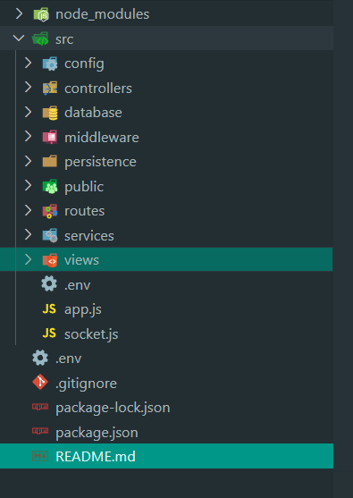

### Objetivos específicos

>✓ Aplicar una arquitectura profesional 

### Para nuestro servidor

>✓ Aplicar prácticas como patrones de diseño, mailing, variables de entorno. etc.

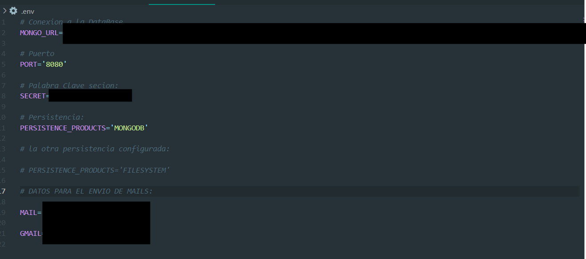

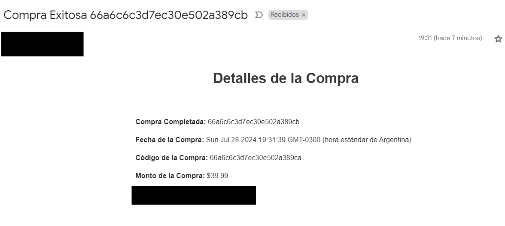

>Vista de Usuario:

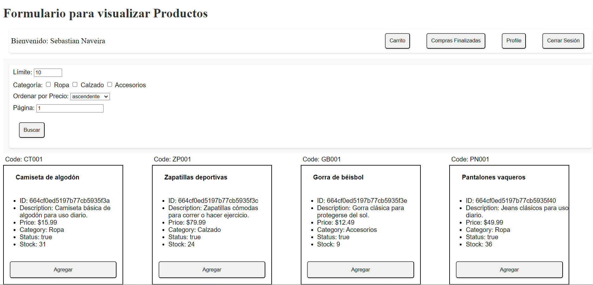

>Vista del carrito del Usuario cada usuario tiene un carrito asignado:

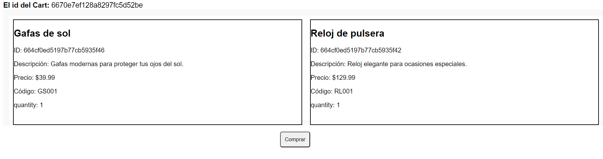

> En compras finalizadas se pueden ver todas las compras de ese usuario:

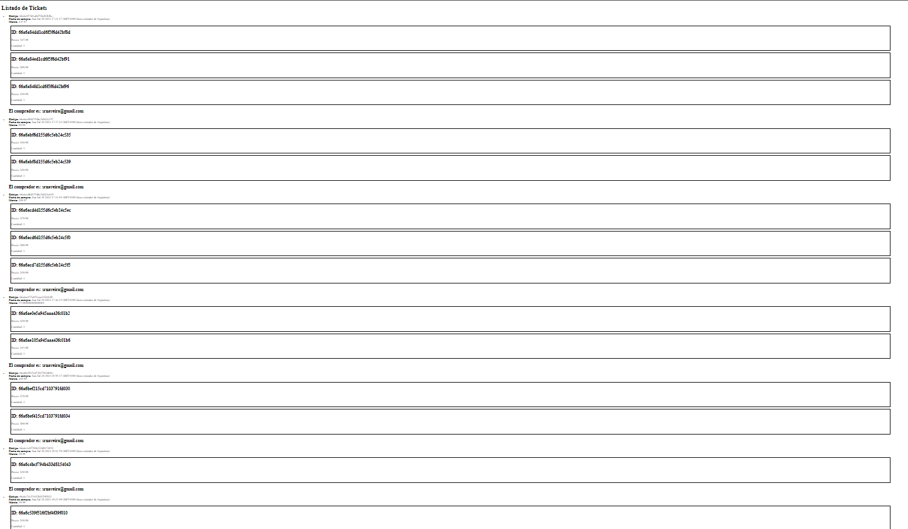

> Al realizar la compra nos da la opcion de enviar un mail con lo datos de la misma: 

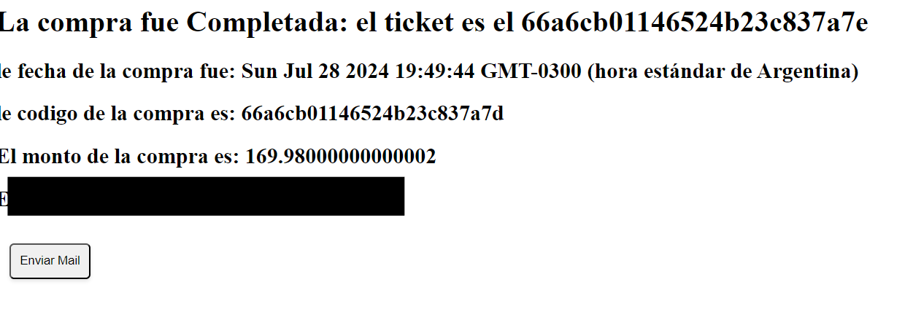

>y si le hacemos click:

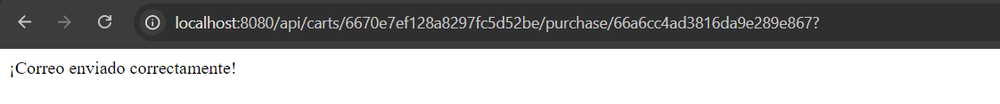

>la configuracion del mail esta dentro del mail.js:

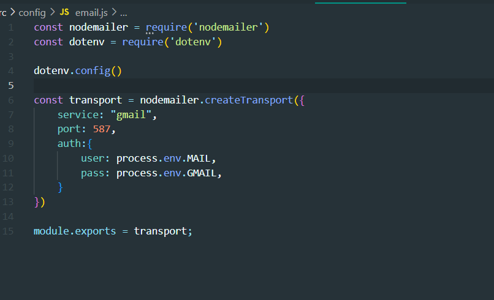

>Genere un Midleware para que verifique si es usuario o admin:

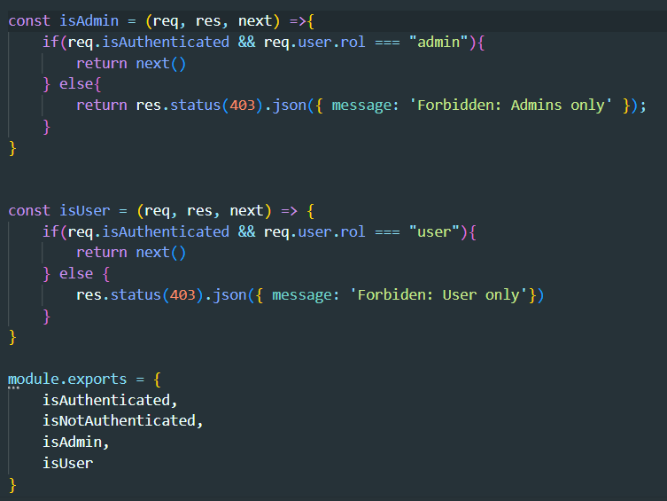

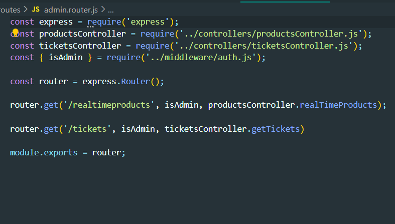

>Vista del admin es el unico que puede agregar productos y eliminarlos:

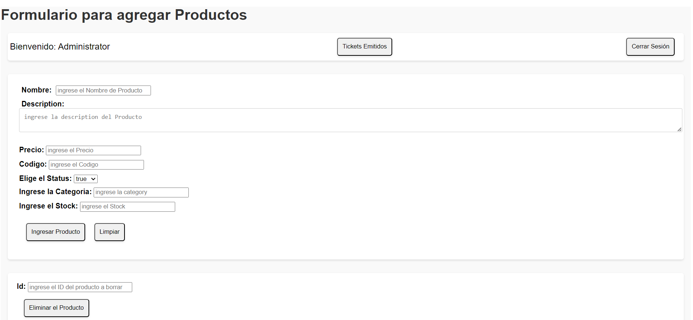

>El admin puede ver todas las compras de todos los usuarios:

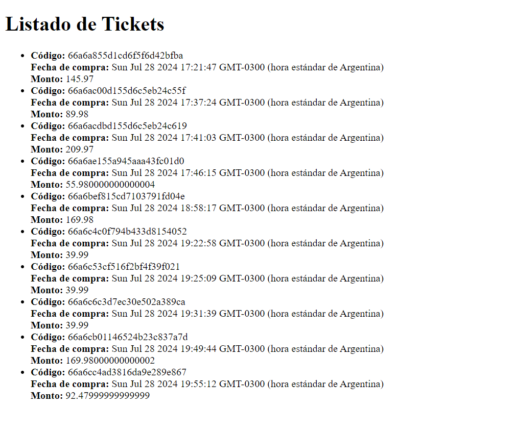

>Se armo un modelo de tickets:

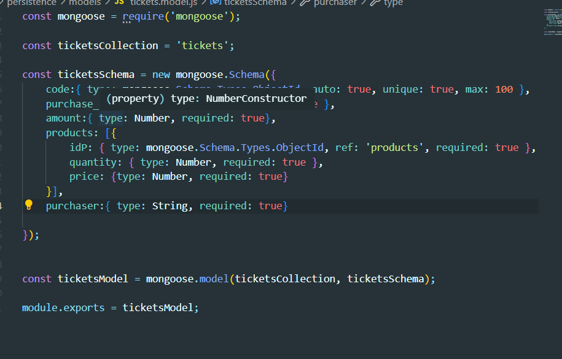

>Por ultimo la persistencia mongodb/filesystem:

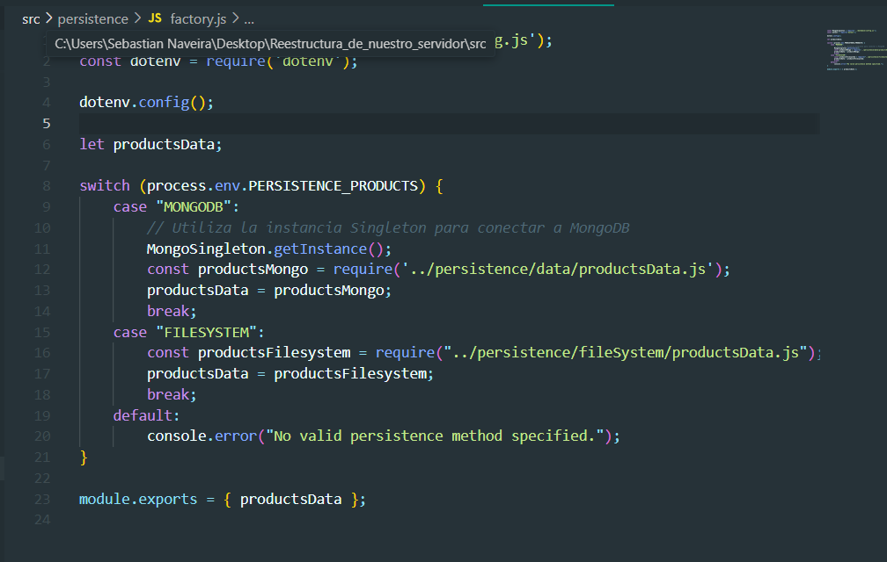